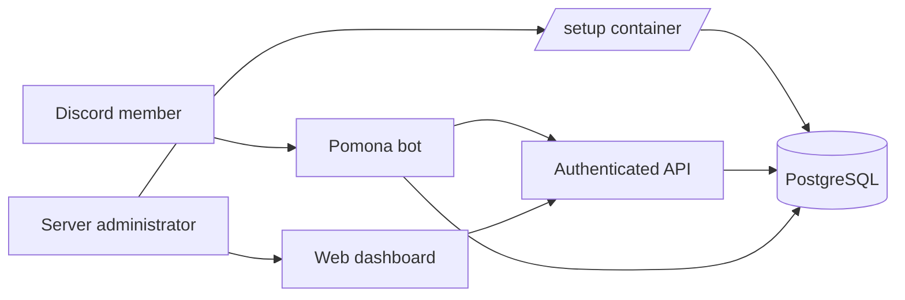

# Pomona

> A Discord community operating system for welcoming members, running server systems, and building a persistent economy.


<p align="center">
  <strong>One bot. One dashboard. A whole server to cultivate.</strong>
</p>

Pomona is a Discord community bot and administration dashboard for managing server systems, moderation-adjacent workflows, community utilities, birthdays, welcome experiences, reaction roles, counting, and a persistent server economy.

The project is organized around four connected experiences:

- A Discord bot for members and administrators
- A web dashboard for server configuration
- An API for authenticated guild management
- A PostgreSQL-backed data layer for server, user, inventory, and system state

## At A Glance

| Area | What Pomona provides |
| --- | --- |
| Community | Welcome images, verification, leave messages, birthdays, and counting |
| Administration | Interactive `/setup`, dashboard configuration, guild authorization, and system panels |
| Engagement | Reaction roles, farming, fishing, scavenger hunts, heists, cooking, and boosts |
| Economy | Global banks, server wallets, inventories, black market, and player shops |



## Feature Map

```text
Pomona
├── Community
│   ├── Welcome and verification
│   ├── Leave messages
│   ├── Birthdays
│   ├── Counting
│   └── Reaction roles
├── Economy
│   ├── Global bank and server wallets
│   ├── Mini-games and farming
│   ├── Cooking and consumable boosts
│   ├── Black market
│   └── Player shops
└── Administration
  ├── Unified Discord setup container
  ├── Web dashboard
  └── Authenticated guild API
```

## Discord Bot

### Unified Setup

Administrators can open one setup command:

```text
/setup
```

The command opens an interactive setup container with a system selector. Administrators can switch between systems without leaving the container or invoking separate setup commands.

Available systems include:

- Welcome messages
- Birthday messages
- Counting
- Reaction roles
- Economy

System configuration uses Discord buttons, channel selectors, role selectors, and modals where appropriate. Setup panels can be enabled or disabled per system. Enabling a system can post a one-time informational embed in an administrator-selected channel, with an optional note that identifies and mentions the administrator who created it. Disabling a system removes its setup panel and clears its enabled state and channel configuration.

### Welcome System

The welcome system provides a configurable onboarding experience for new members.

Features include:

- Configurable welcome channel
- Configurable avatar position:
  - Left
  - Middle
  - Right
- Custom welcome background image
- Default background fallback
- Custom welcome messages
- Multiple welcome messages with random selection
- Member avatar rendering
- Member number rendering
- Discord-style wave interaction
- Welcome image generation with the member name, server name, avatar, and configured channel links
- Welcome messages after verification

Welcome backgrounds are rendered into generated images. The renderer uses the configured background, avatar position, member avatar, and member number while retaining fallback behavior when a custom image cannot be loaded.

### Leave Messages

The bot can send a leave message when a member leaves a server if leave messaging is enabled and a leave channel is configured.

Leave handling includes:

- Member departure embed
- Member profile link
- Bot footer and timestamp
- Wave reaction
- Server statistics updates

### Verification Workflow

The bot supports a verification flow based on a configured reaction message and verified role.

The workflow can:

- Detect a configured verification reaction
- Assign the verified role
- Send a short onboarding message
- Direct the member toward community and roles channels
- Generate the verified member welcome image
- Update the moderation verification message
- Remove the verification record after completion
- Refresh configured member statistics

### Birthday System

Birthdays are stored globally per user and subscribed to on a per-server basis.

Members can use:

```text
/birthday set
/birthday edit
/birthday delete
/birthday get
/birthday announcements action:<enable|disable>
```

Capabilities include:

- Set a birthday in `MM/DD` format
- Edit an existing birthday
- Delete a birthday
- Look up a birthday
- Subscribe to birthday announcements in a server
- Stop receiving birthday announcements in a server
- Notify a server when a birthday occurs
- Support administrator management of other members' birthdays
- Autocomplete birthday users for editing
- Birthday announcement channel configuration
- Birthday log channel configuration
- Birthday list and monthly birthday logging

When a member leaves a server, their subscription to that server is removed. Their global birthday is deleted only when they no longer share any guilds with the bot.

### Counting System

The counting system lets members maintain a shared count in a designated channel.

Administrators can configure:

- Counting channel
- Enabled or disabled state
- Current count
- Highest count
- Last user
- Last count
- Counting participants

The setup container displays the configured channel, current count, and highest count. Counting state is stored per guild.

### Reaction Roles

Reaction roles provide Discord messages that assign roles when members react.

Features include:

- Multi-role reaction panels
- Embed title and description
- Emoji-to-role mappings
- Custom emoji support
- Automatic reaction placement
- Role assignment on reaction add
- Role removal on reaction remove
- Non-managed role validation
- Server-specific panel identifiers
- Panel persistence in the database
- Dashboard management

Administrators can create panels from the setup container by selecting a channel and selecting multiple roles. The bot assigns numbered reactions automatically. A custom panel flow is also available for custom titles, descriptions, emojis, and mappings.

### Economy

The economy is split into global and server-specific values.

Each user has:

- One global bank balance
- One wallet per server
- A separate inventory per server

The economy supports:

- Passive wallet earnings from regular messages
- Server-specific wallets
- Global bank identity
- Per-server item inventories
- Configurable currency name
- Configurable bank name
- Optional currency image
- Optional bank image
- Black-market selling
- Player-to-player shops
- Timed farming
- Timed cooking
- Consumable boosts

#### Economy Games

Games are available through the `/game` command.

##### Heist

```text
/game heist
```

A risky wallet game with:

- Success and failure outcomes
- Wallet gains on success
- Wallet losses on failure
- Cooldowns
- Boosted odds and rewards when a meal boost is active

##### Scavenger Hunt

```text
/game scavenger-hunt
```

Finds items such as:

- Old Coin
- Ancient Map
- Polished Gem
- Mysterious Key

Found items are added to the server-specific inventory.

##### Fishing

```text
/game fishing
```

Finds items such as:

- Minnow
- Silver Trout
- Golden Koi
- Message in a Bottle

Fishing results are stored in inventory and can be sold or listed in the player shop.

#### Farming

Farming is a timed mini-game using the same inventory, selling, and shop systems.

##### Buy Seeds

```text
/game farm-buy-seed seed:<seed>
```

Available seeds include:

- Wheat Seed
- Carrot Seed
- Apple Seed

##### Plant Seeds

```text
/game farm-plant seed:<seed>
```

Each crop takes time to grow. A user has one active farm plot per server.

Current crop growth times:

- Wheat: 2 minutes
- Carrot: 3 minutes
- Apple: 5 minutes

##### Check Farming Status

```text
/game farm-status
```

Displays the active crop and cooking job timers.

##### Harvest Crops

```text
/game farm-harvest
```

Harvesting removes the completed farm plot and adds a random quantity of the crop to inventory.

#### Cooking and Recipes

```text
/game farm-craft recipe:<recipe>
```

Recipes consume inventory ingredients and start a timed cooking job.

Available recipes include:

- Bread
  - Requires wheat
  - 1 minute cooking time
- Vegetable Soup
  - Requires wheat and carrots
  - 2 minute cooking time
- Apple Pie
  - Requires wheat and apples
  - 3 minute cooking time

A user has one active cooking job per server. Finished meals remain in inventory until consumed, sold, or listed.

#### Consumable Boosts

Users can consume crafted recipes with:

```text
/consume recipe:<recipe>
```

Recipes provide temporary boosts across the economy games:

| Recipe | Boost | Duration |
| --- | ---: | ---: |
| Bread | 15% | 30 minutes |
| Vegetable Soup | 30% | 60 minutes |
| Apple Pie | 50% | 90 minutes |

Boost effects include:

- Higher heist success chance
- Larger heist rewards
- More scavenger-hunt items
- More fishing items
- Faster crop growth
- Larger harvests
- Faster cooking

Only one boost is active per user/server. Consuming another recipe replaces the current boost.

#### Black Market

Users can sell inventory items directly to the server's black market:

```text
/game sell item:<item> quantity:<amount>
```

Selling:

- Removes items from inventory
- Adds wallet coins
- Uses the item's configured server-specific value

#### Player Shops

Users can trade items with each other through server-specific listings.

Create a listing:

```text
/game shop-list item:<item> quantity:<amount> price-each:<coins>
```

Browse listings:

```text
/game shop
/game shop item:<item>
```

Buy a listing:

```text
/game shop-buy listing-id:<id>
```

Player shop purchases:

- Transfer wallet coins from buyer to seller
- Transfer listed items to the buyer
- Remove the completed listing
- Prevent sellers from listing more items than they own

#### Economy Item Administration

Administrators can manage each server's item catalog from Discord:

```text
/game item-add game:<game> item:<name> value:<coins>
/game item-edit item:<name> value:<coins>
/game item-remove item:<name>
/game item-list
```

Item definitions control:

- Item name
- Game pool
- Black-market value

Supported game pools include:

- Scavenger hunt
- Fishing
- Farming

### Application Emojis

The bot resolves custom emojis from the Discord application emoji collection instead of relying on fixed environment values.

Emoji resolution supports:

- Static application emojis
- Animated application emojis
- Name-based lookup
- Correct Discord emoji mention formatting

### Statistics and Channel Counters

The bot tracks server statistics separately from guild configuration.

Tracked statistics include:

- User count
- Bot count
- Total member count
- Configured statistic channels

The bot updates statistics when members join, leave, verify, and when scheduled channel updates run.

### Persistent Server Data

The database stores server-specific state for:

- Guild configuration
- Server statistics
- Welcome settings
- Birthday settings and subscriptions
- Counting state
- Reaction-role panels
- Economy settings
- Economy item definitions
- Economy inventories
- Economy wallets
- Farming plots
- Cooking jobs
- Active boosts
- Player shop listings
- Verification records
- Task messages

## Dashboard

The web dashboard lets administrators manage guild systems through a Discord-inspired interface.

### Guild Navigation

Guild management pages include a hamburger navigation menu with:

- Back to servers
- Back to systems

The menu is available while configuring a guild or a specific guild system.

### Dashboard Systems

Available dashboard systems include:

- Welcome
- Birthdays
- Community channels
- Counting
- Reaction roles
- Economy

### Welcome Dashboard

Administrators can configure:

- Welcome channel
- Avatar position
- Custom background URL
- Custom welcome messages
- Multiple randomized welcome messages

The dashboard includes a Discord-style preview showing:

- Pomona's message
- Greeting text
- Welcome image
- Member avatar
- Member number
- Wave button
- Linked introduction and roles channels

### Birthday Dashboard

Administrators can configure:

- Birthday announcement channel
- Birthday log channel
- Birthday enabled state

### Counting Dashboard

Administrators can configure:

- Counting channel
- Counting enabled state

### Reaction Roles Dashboard

Administrators can:

- Select a text channel
- Create multi-role reaction embeds
- Choose emoji and role mappings
- Preview the Discord-style message
- View posted panels
- Delete posted panels

### Economy Dashboard

Administrators can customize:

- Currency name
- Bank name
- Currency image URL
- Bank image URL

They can also manage the server item catalog:

- Add items
- Assign items to Scavenger Hunt, Fishing, or Farming
- Edit item values
- Change an item's game pool
- Remove items

Dashboard economy item changes are shared with Discord game commands.

## API

The API provides authenticated guild management and system data services.

Capabilities include:

- Discord OAuth authentication
- Guild authorization checks
- Administrator permission checks
- Bot presence checks
- Guild settings reads and updates
- Reaction-role CRUD operations
- Economy item catalog CRUD operations
- Server channel and role loading
- Bot health checks
- Database health checks
- Discord API health checks

All guild administration routes verify that the authenticated user has administrator access to the guild and that the bot is present before allowing management operations.

## Data Ownership and Scope

The project separates global and guild-specific data intentionally.

Global per-user data:

- User identity
- Bank balance
- Birthday record

Guild-scoped data:

- Wallet balance
- Inventory
- Farm plot
- Cooking job
- Active boost
- Player shop listings
- Item definitions
- System settings
- Reaction-role panels
- Birthday subscriptions
- Counting state

This allows the same Discord user to maintain a global bank and birthday while having independent wallets, inventories, games, and marketplace activity in each server.
